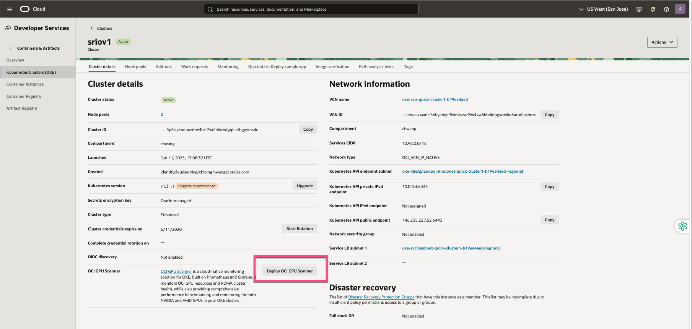
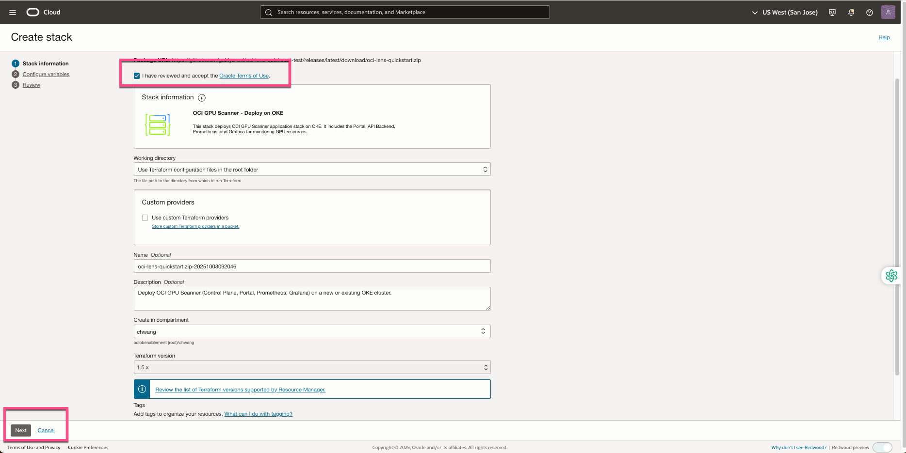
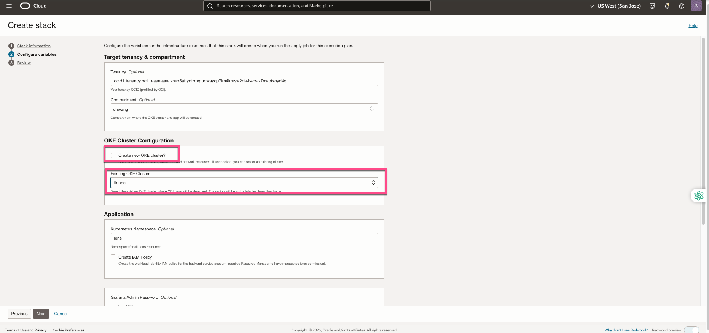
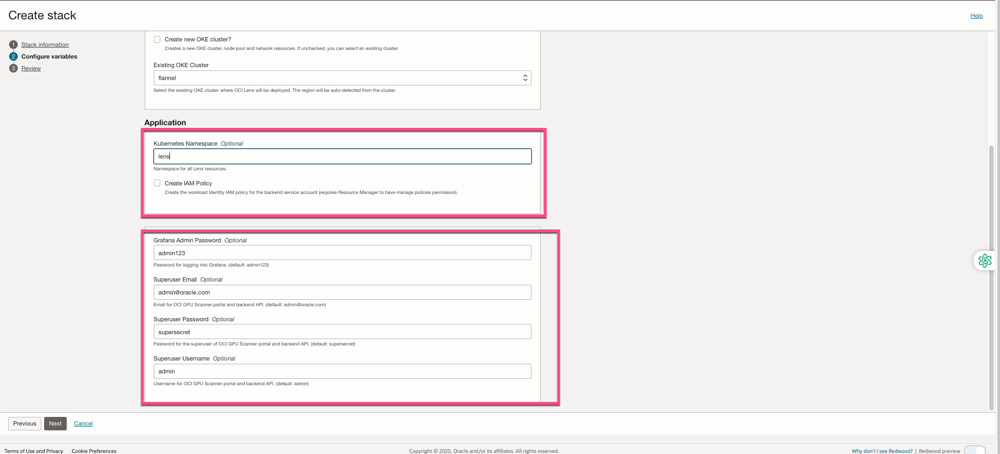
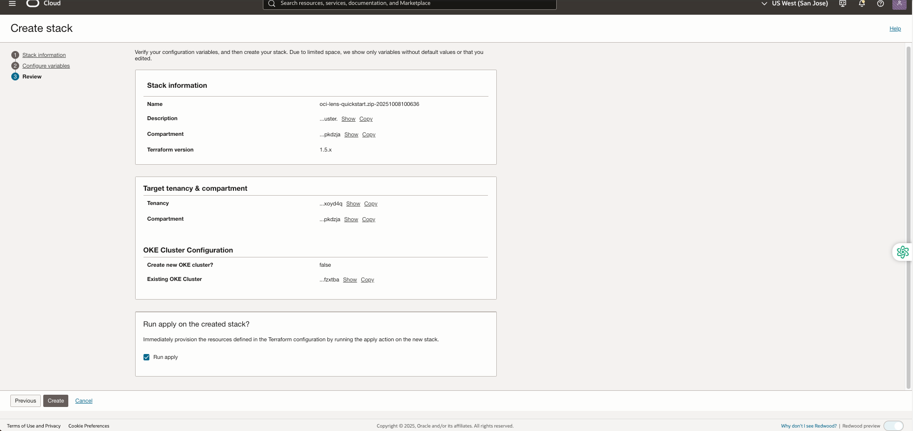
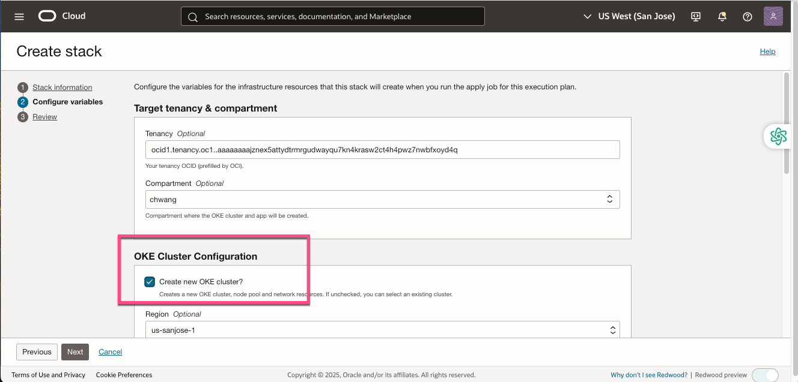
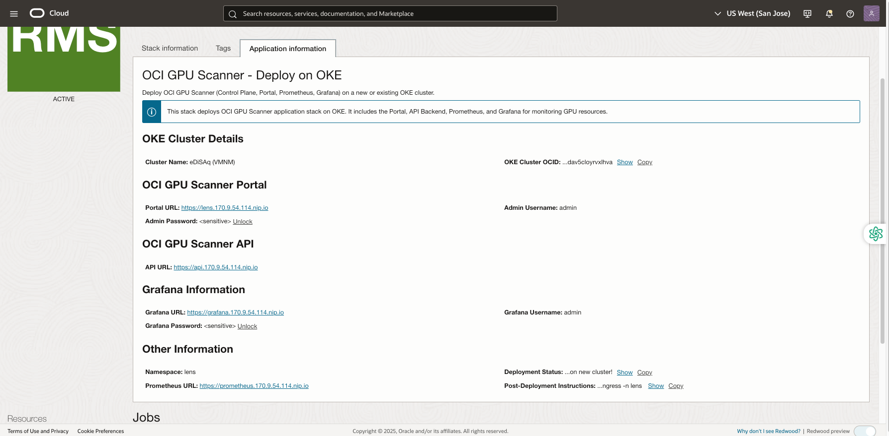
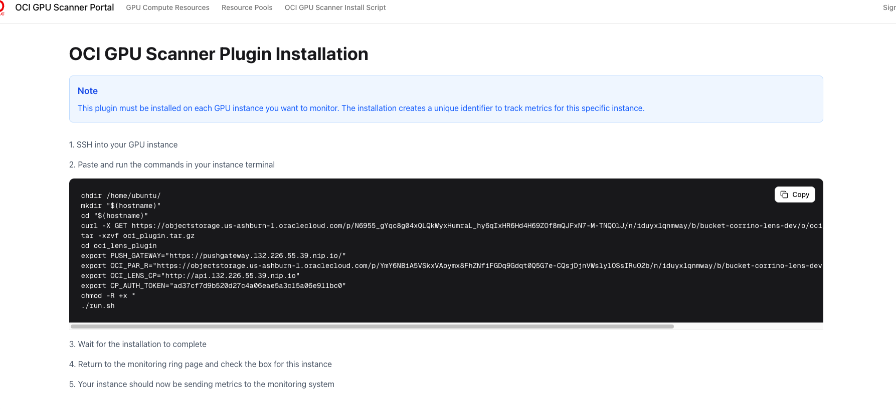

# Installing OCI GPU Scanner via OKE Console

❗❗**IMPORTANT:** This guide focuses on installing the **OCI GPU Scanner Control Plane** through the **OKE Console**, which provides a simplified, guided workflow for deploying the control plane. This method is the **recommended approach** for most users, as it automates resource creation and configuration within your OCI Console.

## Product Components

OCI GPU Scanner has 2 main components:
* **OCI GPU Scanner Control Plane** - Installed on a single OKE cluster, it centrally manages and monitors multiple OKE clusters.  
* **OCI GPU Data Plane Client Plugin** - Installed on each OKE worker node that includes a GPU.

### Deploying OCI Scanner Control Plane to an Existing OKE Cluster

When deploying **OCI GPU Scanner** to an existing OKE cluster, the following components are created in your OKE cluster installation process:
- **OCI GPU Scanner Application**, which includes:  
  - **OCI GPU Scanner Portal** (Control Plane / UI)  
  - **OCI GPU Scanner Backend API**  
  - **Prometheus Server** (for metrics collection)  
  - **Grafana Server** (for dashboards and visualization)  
  - **PostgreSQL Database** (for internal data management) 

**Steps:**

1. In the OCI Console, go to Developer Services > Kubernetes Clusters (OKE) > [Cluster Name] > Cluster Details, then select Deploy OCI GPU Scanner.

   

2. This will redirect to the Oracle Resource Manager (ORM) page. Select "I have reviewed and accept the Oracle Terms of Use" and click Next.

   

3. If deploying to an existing cluster, clear the "Create new OKE cluster?" option, then select the cluster where you want to deploy OCI GPU Scanner in the dropdown.

   

4. **Configure the installation options:**

   - Specify the **namespace** for deploying **OCI GPU Scanner** (default: `lens`).  
   - Select **Create IAM Policy** if an IAM policy needs to be created.
   For more details about IAM policies, see the [Oracle IAM Policies documentation](https://docs.oracle.com/en-us/iaas/Content/Identity/policieshow/Policy_Basics.htm).  
   - Enter a **Grafana Admin Password** (default: `admin123`).  
   - (Optional) Provide a **Superuser Email**.  
   - Enter a **Superuser Username** (default: `admin`).  
   - Click **Next** to continue.

   

5. Review your configuration and confirm the installation and click created

   

### Deploy OCI GPU Scanner Control Plane on a New OKE Cluster

When deploying **OCI GPU Scanner** on a new OKE cluster, the following components are created in your tenancy as part of the installation process:

- **VCN** – Configured with the required networking and security settings for OKE.  
- **OKE Cluster** – Created with **3 VM.Standard.E3.Flex** worker nodes (10 OCPUs and 100 GB memory each, recommended).  
- **OCI GPU Scanner Application**, which includes:  
  - **OCI GPU Scanner Portal** (Control Plane / UI)  
  - **OCI GPU Scanner Backend API**  
  - **Prometheus Server** (for metrics collection)  
  - **Grafana Server** (for dashboards and visualization)  
  - **PostgreSQL Database** (for internal data management)  
- **IAM Policies** – Automatically created with the required permissions for OCI GPU Scanner.

For more details about IAM policies, see the [Oracle IAM Policies documentation](https://docs.oracle.com/en-us/iaas/Content/Identity/policieshow/Policy_Basics.htm).

**Steps:**

1. In the OCI Console, go to Developer Services > Kubernetes Clusters (OKE) > [Cluster Name] > Cluster Details, then select Deploy OCI GPU Scanner.

   

2. This will redirect to the Oracle Resource Manager (ORM) page. Select "I have reviewed and accept the Oracle Terms of Use" and click Next.

      

3.Ensure the Create new OKE cluster? option remains selected to provision a new OKE cluster for this deployment.

   

4. **Configure the installation options:**

   - Specify the **namespace** for deploying **OCI GPU Scanner** (default: `lens`).  
   - Select **Create IAM Policy** if an IAM policy needs to be created.  
   - Enter a **Grafana Admin Password** (default: `admin123`).  
   - (Optional) Provide a **Superuser Email**.  
   - Enter a **Superuser Username** (default: `admin`).  
   - Click **Next** to continue.

   

5. Review your configuration and confirm the installation and click created

   

## What You'll Get After Installation

Once the installation is complete, navigate to Developer Services > Resource Manager > Stacks > [stack name] > Application Information to view the details for accessing the installed OCI GPU Scanner.

1. **Portal URL** - URL to access the OCI GPU Scanner Portal
2. **OCI GPU Scanner API** - API REST endpoints

 

   ### Deploy OCI GPU Scanner GPU Data Plane Client Plugin

   The OCI GPU Scanner Data Plane Client Plugin must be installed on each OKE worker node that requires monitoring. Installation is performed using a shell script available from the Control Plane portal.

1. In the OCI GPU Scanner Portal, navigate to OCI GPU Install Script, copy the installation script, then SSH into the worker node and run the script to install the plugin.

   