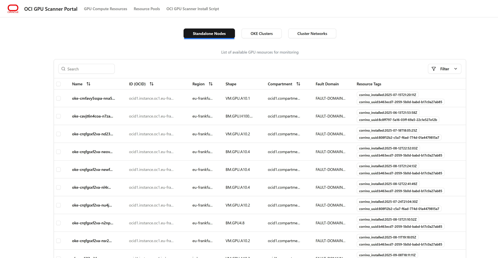
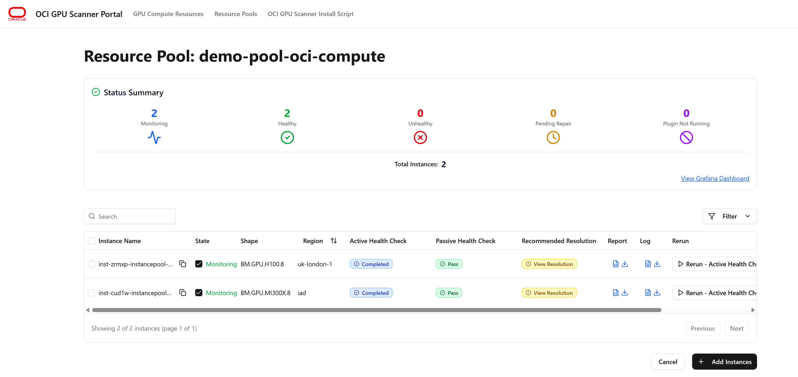
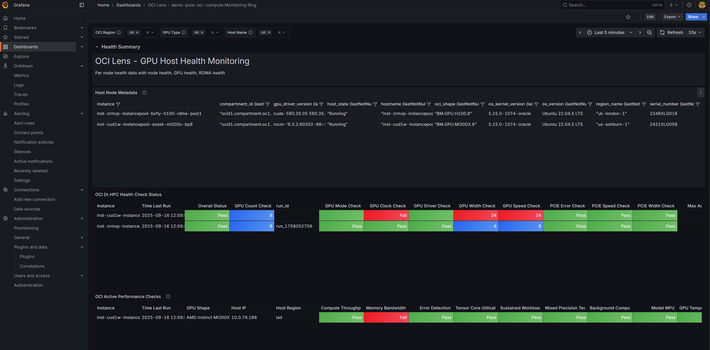
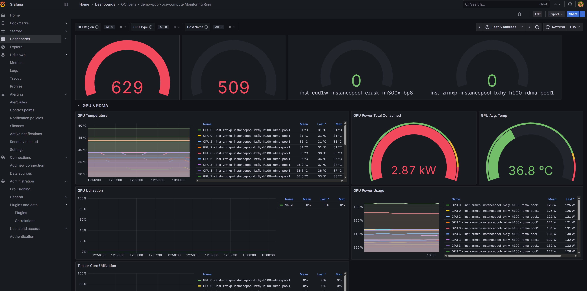

# OCI GPU Scanner Solution
**Active GPU performance health check and monitoring tool for OCI GPU compute resources.**

OCI GPU Scanner is a cloud-native, Prometheus- and Grafana-based solution for monitoring OCI GPU cluster resources and RDMA cluster health. It is deployed directly within your OCI tenancy. This solution provides comprehensive, active performance and passive health checks for both NVIDIA and AMD GPUs on OCI. OCI GPU Scanner executes periodic OCI-authored GPU health checks and pushes the results to a dedicated OCI GPU Scanner Portal, Prometheus, and Grafana Dashboards. Since everything is deployed in your tenancy, you can extend the solution to integrate additional metrics (such as PyTorch or vLLM Serving metrics) into the Grafana boards for a holistic view of application and hardware metrics. This solution is free for any OCI customer to use.

## Features
- Tenancy-level monitoring solution – no region barriers no compartment restrictions
- Supports Nvidia A10, A100, H100, B200, H200 and AMD GPU MI300X OCI GPU shapes
- Supports native OKE integration running as a daemon set as well as system service if running on the single-node -  Bare Metal or virtual machines
- Full GPU metrics collection through NVIDIA DCGM Exporter and AMD SMI Exporter including custom RDMA cluster and NIC performance metrics collection
- Active performance health checks (PyTorch-based), benchmarked against a baseline stating if the numbers are within the threshold
- Passive health data run periodically and results sent to the Prometheus server using the Prometheus schema
- Grafana dashboards pre-configured giving you the view at cluster level, node level or at GPU node level filters
- Ability to run on-demand active health checks when performance degradation is observed at the individual node level using REST APIs
- Data never leaves your tenancy boundary giving you full control and a private experience
- Integrated with OKE Node Problem Detector and auto tagging nodes to no-schedule when heath check fail

## Getting Started
To install OCI GPU Scanner, you have the below options. The solution is installed within your OCI tenancy and is currently not a managed service within OCI:

- [Install through Terraform & OCI Resource Manager Template (includes a new OKE cluster install)](./GETTING_STARTED_RM_DEPLOY.md)
- [Install through OKE Managed Add-On Deployment through OCI Console for existing OKE cluster](./GETTING_STARTED_CONSOLE_DEPLOY.md)
- [Install through **helm** on existing OKE cluster](./GETTING_STARTED_HELM_DEPLOY.md)

## Health Checks

OCI GPU Scanner performs both passive (non-intrusive) and active (GPU-occupying) performance health checks. Results are reported in the Grafana dashboard. 

### Active Performance Checks
Active health checks run when the OCI GPU Scanner plugin is installed on GPU nodes. These checks can also be initiated on demand through the portal or via REST API endpoints provided by OCI GPU Scanner. All active checks use PyTorch Matmul and Linear Regression to generate performance scores. Multi-node health checks utilize Message Passing Interface (MPI) to stress test HPC cluster configurations.

See samples of health check [for H100 active check runs.](./sampleoutput/nvidia_h100_active_healthcheck_singlenode_sample.json) and [for AMD MI300X active check runs.](./sampleoutput/amd_mi300x_active_healthcheck_singlenode_sample.json).

Below checks are part of GPU Active Health Check Tests

- model_mfu
- background_computation
- compute_throughput
- memory_bandwidth
- error_detection
- tensor_core_utilization
- sustained_workload
- mixed_precision_testing
- gpu_power_check
- gpu_temperature_check
- gpu_utilization_check
- gpu_topology
- gpu_xid_errors_check
- gpu_xid_errors_check
- rdma_mpi_multinode_all2all
- rdma_mpi_multinode_allgather
- rdma_mpi_multinode_allreduce
- rdma_mpi_multinode_broadcast

### Passive Health Checks
Passive checks do not occupy GPUs and run periodically in the background. By default, these run every minute, but you can adjust the frequency during installation. These scripts are maintained by the OCI GPU Core Compute team and released as part of Dr.HPC V2 binaries. The following checks are currently performed for both Nvidia and AMD GPU compute nodes:

Below are the checks currently run for both Nvidia and AMD based GPU compute nodes. 

- GPU count check: Checks GPU count using nvidia-smi and amd-smi
- PCIe error check: Checks for PCIe errors in system logs
- PCIe speed check: Verifies PCIe speed matches the expected threshold
- PCIe width missing lanes check: Checks PCIe link width for missing lanes
- RDMA NIC count: Checks the number of RDMA NICs
- RX discards check: Checks the network interface for RX discards
- GID index check: Verifies device GID index is within the correct range
- Link check: Checks RDMA link state and parameters
- Ethernet link check: Checks Ethernet link state and parameters for 100GbE RoCE interfaces
- Auth check: Checks authentication status of RDMA interfaces using wpa_cli
- SRAM error check: Checks for both correctable and uncorrectable SRAM errors
- GPU driver check: Checks GPU driver version compatibility
- GPU clock check: Ensures GPU clock speeds are within the acceptable range
eth0 presence check: Checks if the eth0 network interface is present
- HCA error check: Checks for MLX5 HCA fatal errors in system logs
- Missing interface check: Checks for missing PCIe interfaces (revision ff)
- Thermal throttling check: Monitors GPU for thermal throttling events
- Source-based routing check: Verifies source-based routing configuration for - RDMA network communication
- Oracle Cloud Agent version check: Confirms Oracle Cloud Agent version meets minimum requirements
- RDMA link flap check: Identifies RDMA link flap events in system logs
- PCIe walk check: Validates PCIe hierarchy for GPU and RDMA devices, including link speeds and widths
- Max ACC check: Checks MAX_ACC_OUT_READ and ADVANCED_PCI_SETTINGS configuration
- Row remap error check: Uses nvidia-smi to check for GPU row remap errors
- RTTCC status check: Checks Real Time Telemetry Congestion Control (RTTCC) status for H100 GPU hosts
- Model MFU, background computation, compute throughput, memory bandwidth, error detection, tensor core utilization, sustained workload, mixed precision testing, - GPU power check, GPU temperature check, GPU utilization check, GPU topology, GPU XID errors check, RDMA MPI multinode all2all/allgather/allreduce/broadcast, etc.

Additional checks are performed based on GPU type (AMD or NVIDIA), such as XGMI, NVLINK, and fabric manager monitoring.

## Architecture

The Helm chart deploys the following components:

1. **Frontend (Portal)**
   - React/Node.js application
   - Served on port 3000
   - Service for internal/external access

2. **Backend (Control Plane)**
   - Django application
   - Served on port 5000 (container), 80 (service)
   - External access via LoadBalancer service
   - Connects to Postgres
   - Configured with Prometheus Push gateway and Grafana URLs

3. **Postgres Database**
   - Managed via StatefulSet/Deployment
   - Persistent storage via PVC
   - Service for backend connectivity

4. **ConfigMaps and Secrets**
   - All environment variables and sensitive data are managed via ConfigMaps and Kubernetes Secrets

Sample deployment stamp.

## Dashboards & Monitoring
After deployment, you will have access to Grafana, Prometheus, and Portal endpoints for data interaction. See example screenshots below:

## Third Party Software Dependency

The below Open-Source solutions are used in this solution:

1. [Grafana](https://github.com/grafana/grafana)
2. [Prometheus](https://github.com/prometheus/prometheus)
3. [NGINIX Controller for Kubernetes](https://github.com/kubernetes/ingress-nginx)
4. [PostgreSQL](https://www.postgresql.org/)
5. [NVIDIA DCGM Exporter](https://github.com/NVIDIA/dcgm-exporter)
6. [AMD SMI Exporter](https://github.com/amd/amd_smi_exporter)
7. [Prometheus Node Exporter](https://github.com/prometheus/node_exporter)

## Roadmap
The below list of features are being prioritized. If you would like a new feature please open a issue or email the contacts listed below. 
### Health Checks
- Multi-Node NCCL/RCCL
- PyTorch FSDP Multi-Node Training Testing RDMA Backend
- Low priority Kubernetes jobs auto scheduling of active-checks
- B200 NVLink & Infiniband MPI validations

### Onboarding
- Public and private domain access deployments of ingress controller for control plane access
- Narrowed down OCI tenancy policy options

### Portal & Experiences

- Advanced Grafana boards with K8s job filtering
- Deployment through OCI Console

## Remediation

- OKE Node problem detector integration for taints
- Auto-remediation controller for self healing

### GPU’s Support

- GB200 & ARM64 Runtime Support
- AMD MI355X

## Limitations

1. Only Ubuntu Linux OS based GPU node monitoring is supported.
2. Control plane components only work with x86 CPU nodes.
3. Active health checks do not run as low priority jobs hence running a active health check will disrupt any existing GPU workloads active on that node.   

## Support & Contact

This solution is provided with no Service Level Objectives (SLOs) or Service Level Agreements (SLAs) from Oracle. However, a dedicated team product manages the solution and will do their best to support any issues you may encounter. We also have a dedicated OCI Compute engineering team that support active and passive health check scripts. For questions, issues, or feedback, please contact amar.gowda@oracle.com.
