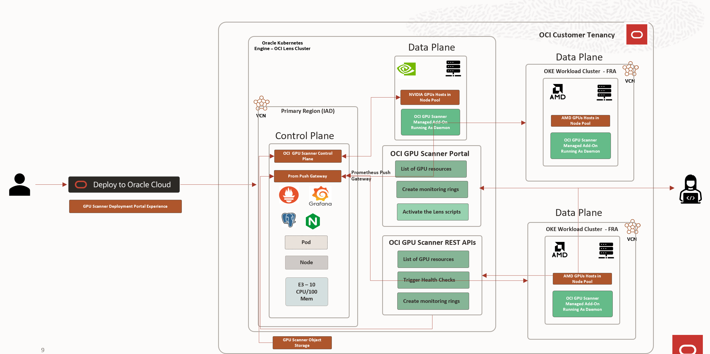

# 🔍 OCI GPU Scanner Service (Preview)

**Active GPU performance health check and monitoring tool for OCI GPU compute resources.**

---

## 📋 Table of Contents
- [Overview](#-overview)
- [Key Features](#-key-features)
- [Quick Start](#-quick-start)
- [Health Checks](#-health-checks)
- [Architecture](#-architecture)
- [Dashboards & Monitoring](#-dashboards--monitoring)
- [Dependencies](#-third-party-software-dependency)
- [Roadmap](#-roadmap)
- [Limitations](#-limitations)
- [Support & Contact](#-support--contact)

---

## 🎯 Overview

OCI GPU Scanner is a **cloud-native monitoring solution** for OCI GPU clusters, powered by Prometheus and Grafana. It runs directly in your OCI tenancy, giving you complete control and privacy—your data never leaves your environment.

### What It Does
- ✅ Monitors GPU health and performance (NVIDIA & AMD)
- ✅ Validates RDMA cluster connectivity
- ✅ Provides real-time dashboards and metrics
- ✅ Executes active performance checks and passive health monitoring
- ✅ Integrates with your existing infrastructure

### Why Use It
- **Free**: Available to all OCI customers at no cost
- **Private**: Deployed in your tenancy—you control the data
- **Comprehensive**: Covers both hardware and application metrics
- **Extensible**: Integrate PyTorch, vLLM, or custom metrics

---

## ✨ Key Features

### 🚀 Usability
- **Tenancy-wide monitoring** – no region or compartment restrictions
- **Multi-GPU support**: NVIDIA (A100, H100, B200, H200) and AMD (MI300X)
- **Flexible deployment**: Native OKE integration (DaemonSet) or system service (bare metal/VMs)
- **On-demand checks**: Trigger active health checks via REST API when needed
- **Complete privacy**: All data stays within your tenancy boundary

### 📊 Metrics & Health Checks
- **GPU metrics collection** via NVIDIA DCGM Exporter and AMD SMI Exporter
- **Custom RDMA cluster metrics** for network performance
- **Active checks** (GPU-occupying): PyTorch-based benchmarks with baseline thresholds
- **Passive checks** (non-intrusive): Periodic monitoring without disrupting workloads
- **Pre-configured Grafana dashboards** with cluster, node, and GPU-level views

### 🔧 Extensibility
- Integrates with **OKE Node Problem Detector** for auto-tagging failed nodes
- Supports **bring-your-own Prometheus/Grafana** instances
- Easily extend with custom metrics (PyTorch, vLLM, etc.)

---

## 🚀 Quick Start

Choose your preferred installation method:

| Method | Best For | Link |
|--------|----------|------|
| **Terraform & OCI Resource Manager** | New deployments (includes OKE cluster) | [Getting Started Guide](./GETTING_STARTED_RM_DEPLOY.md) |
| **OKE Managed Add-On** | Existing OKE clusters (via Console) | [Console Deploy Guide](./GETTING_STARTED_CONSOLE_DEPLOY.md) |
| **Helm** | Existing OKE clusters (CLI) | [Helm Deploy Guide](./GETTING_STARTED_HELM_DEPLOY.md) |

---

## 🏥 Health Checks

OCI GPU Scanner performs two types of health checks:

### ⚡ Active Performance Checks
**Note**: These checks occupy GPUs during execution.

Active checks run when the plugin is installed or triggered on-demand via the portal/REST API. They use PyTorch operations (Matmul, Linear Regression) to generate performance scores, and leverage MPI for multi-node cluster testing.

**Sample outputs**:
- [H100 active check results](./sampleoutput/nvidia_h100_active_healthcheck_singlenode_sample.json)
- [AMD MI300X active check results](./sampleoutput/amd_mi300x_active_healthcheck_singlenode_sample.json)

#### Checks Performed:
- Model MFU (Model FLOPs Utilization)
- Background computation
- Compute throughput
- Memory bandwidth
- Error detection
- Tensor core utilization
- Sustained workload
- Mixed precision testing
- GPU power, temperature, and utilization
- GPU topology and XID errors
- RDMA MPI multi-node tests (all2all, allgather, allreduce, broadcast)

### 🛡️ Passive Health Checks
**Note**: These do NOT occupy GPUs.

Passive checks run every minute by default (configurable during installation). They're maintained by the OCI GPU Core Compute team and included in Dr.HPC V2 binaries.

#### Checks Performed (NVIDIA & AMD):
- GPU count verification
- PCIe error, speed, and width checks
- RDMA NIC count and link validation
- Network RX discards and GID index
- Ethernet link state (100GbE RoCE)
- Authentication status (wpa_cli)
- SRAM error detection
- GPU driver version compatibility
- GPU clock speeds
- eth0 interface presence
- HCA fatal errors
- Thermal throttling monitoring
- Source-based routing configuration
- Oracle Cloud Agent version
- RDMA link flap detection
- PCIe hierarchy validation
- Row remap errors (nvidia-smi)
- RTTCC status (H100)

**GPU-specific checks**: XGMI (AMD), NVLINK, fabric manager (NVIDIA).

Failures include recommended remediation actions.

---

## 🏗️ Architecture

### Control Plane Components

| Component | Technology | Port | Access |
|-----------|-----------|------|--------|
| **Frontend (Portal)** | React/Node.js | 3000 | Internal/External |
| **Backend (Control Plane)** | Django | 5000 (container), 80 (service) | External (LoadBalancer) |
| **Database** | PostgreSQL | - | Internal (StatefulSet/PVC) |
| **Configuration** | ConfigMaps & Secrets | - | - |

### Data Plane / Node Plugin Components
- NVIDIA DCGM Exporter
- AMD SMI Exporter
- Prometheus Node Exporter
- OCI GPU Scanner Active & Passive Health Check Scripts
- Prometheus Schema Converters
- Control Plane Connectors

### Deployment Diagram

---

## 📈 Dashboards & Monitoring

After deployment, you'll have access to:
- **Grafana**: Real-time metrics and health check visualization
- **Prometheus**: Metrics storage and querying
- **Portal**: Resource management and on-demand checks

### Portal Screenshots

**GPU Nodes Overview**  

**Resource Groups**  

### Grafana Dashboards

**Health Check Summary**  

**GPU Metrics**  

---

## 📦 Third-Party Software Dependency

This solution uses the following open-source projects:

1. [Grafana](https://github.com/grafana/grafana)
2. [Prometheus](https://github.com/prometheus/prometheus)
3. [NGINX Ingress Controller for Kubernetes](https://github.com/kubernetes/ingress-nginx)
4. [PostgreSQL](https://www.postgresql.org/)
5. [NVIDIA DCGM Exporter](https://github.com/NVIDIA/dcgm-exporter)
6. [AMD SMI Exporter](https://github.com/amd/amd_smi_exporter)
7. [Prometheus Node Exporter](https://github.com/prometheus/node_exporter)

---

## 🗺️ Roadmap

We're actively developing new features. Want something specific? [Open an issue](../../issues) or contact us below!

### Health Checks
- [ ] Multi-Node NCCL/RCCL testing
- [ ] PyTorch FSDP multi-node training with RDMA
- [ ] Low-priority Kubernetes job auto-scheduling for active checks
- [ ] B200 NVLink & InfiniBand MPI validations

### Onboarding
- [ ] Public and private domain access for ingress controller
- [ ] Simplified OCI tenancy policy options

### Portal & Experience
- [ ] Advanced Grafana boards with K8s job filtering
- [ ] Deployment via OCI Console

### Remediation
- [ ] OKE Node Problem Detector integration for taints
- [ ] Auto-remediation controller for self-healing

### GPU Support
- [ ] GB200 & ARM64 runtime support
- [ ] AMD MI355X

---

## ⚠️ Limitations

1. **OS Support**: Only Ubuntu Linux-based GPU nodes are supported
2. **Control Plane**: Requires x86 CPU nodes
3. **Active Checks**: Do not run as low-priority jobs—will disrupt existing GPU workloads

---

## 💬 Support & Contact

This solution is provided **without SLOs or SLAs** from Oracle. However, a dedicated team manages the product and will support issues on a best-effort basis. The OCI Compute engineering team maintains the health check scripts.

**Questions, issues, or feedback?**  
📧 Contact: amar.gowda@oracle.com
